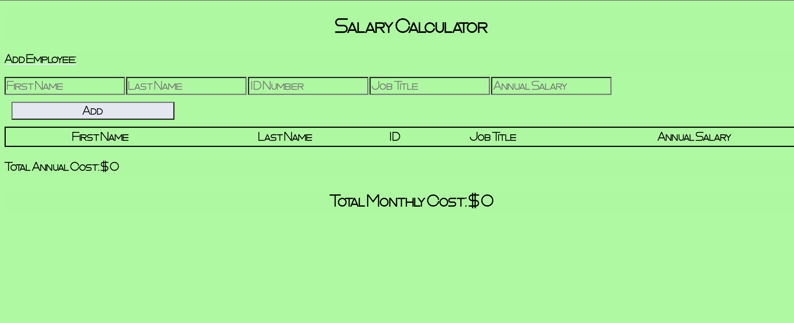
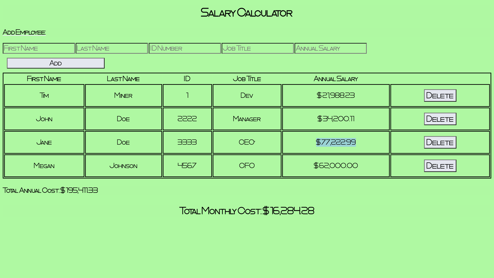

# PROJECT NAME
Weekend jquery salary calculator

## Description

_Duration: 10 hours.

This project was about allowing businesses to quickly and accurately put in employees along with their annual salaries. In order to get an idea of the employee workforce total monthly cost. There is also a check hard coded in to see when the monthly total is above 20k. When it is, the number will highlight red for the user.

## Screen Shot

 

### Prerequisites

NONE

## Usage
How does someone use this application? Tell a user story here.

1. Add in the values for an employee in the labeled boxes
2. It is alright to leave values which you don't know, empty. 
3. After entering all the values for the employee. Press the "Add" button
4. The Employee has now been added, and information to show on the screen. 
5. Hitting the delete button will remove the employee in the same row as the button you clicked. 
6. See the indicators for both "Total monthly cost" and "Total annual cost".

## Built With

HTML, CSS, JS, jQuery

## Acknowledgement
Than you to Prime, and thanks to the many members in my cohort learning with me both in person, and talking about programming on the weekend. 

## Support
If you have suggestions or issues, please email me at [mnheat.miner@gmail.com](www.google.com)